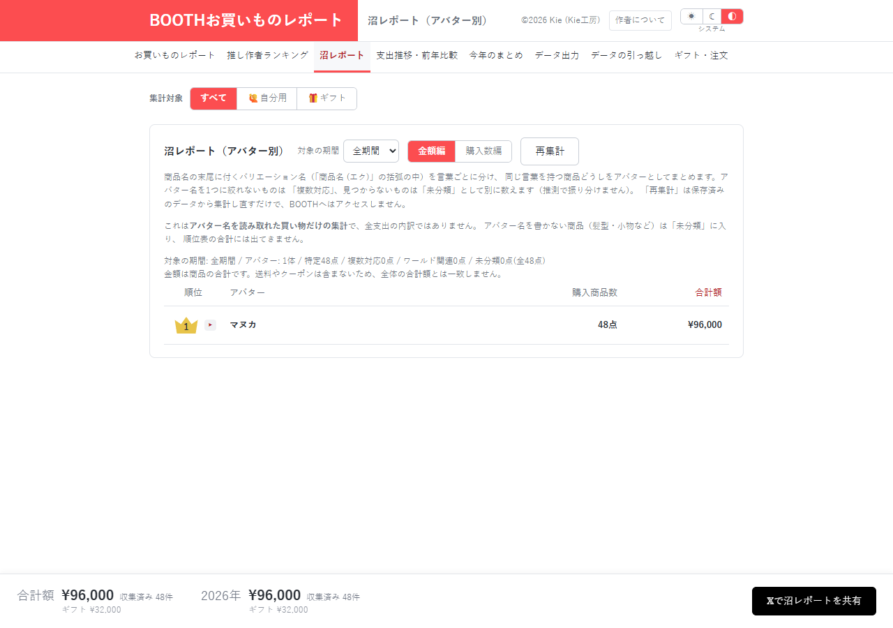

# 沼レポート：分類方法の説明と重複計算を見直す

[資料一覧へ](../README.md)。保存した商品名や手動割当からアバターを分類し、金額・点数をまとめる画面です。

| 指摘 | 利用者・保守担当者への影響 |
| --- | --- |
| [COM-02 / P3](../04-comments.md#com-02) | 末尾の括弧だけを中心に説明し、手動割当や商品名本体も扱う現在の処理が伝わりにくい |
| [EFF-01 / P2](../05-efficiency.md#eff-01) | この画面と年間まとめでアバター分類を重ねて実行する |
| [UX-03・04 / P3](../03-ux.md) | 手動割当はバックアップに含まれ、履歴・金額の削除後も残るが、操作画面の説明が不足する |

現在使っている入力と優先順位を説明し、開発番号や測定経緯は詳細資料へ分けます。計算の改善は、表示している画面に必要な処理だけを実行するところから始めます。

合成の「マヌカ対応」48商品を1分類に集計できました。多様な実商品に対する分類精度は、この確認では測定していません。

