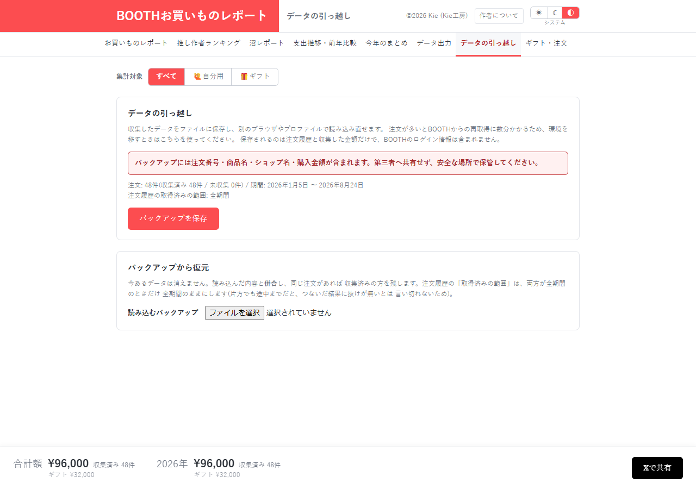

# データの引っ越し：復元前の検証と保存範囲の説明をそろえる

[資料一覧へ](../README.md)。バックアップJSONを保存・読み込みする画面です。

| 指摘 | 利用者への影響 |
| --- | --- |
| [DATA-03 / P2](../01-data-integrity.md#data-03) | 履歴が空の環境へ重複IDを含むバックアップを読むと、同じ注文を二重計上する |
| [DATA-05 / P2](../01-data-integrity.md#data-05) | 不正な型のgiftIdが保存され、直後の全画面描画で例外になる |
| [UX-03 / P3](../03-ux.md#ux-03) | 商品情報・手動割当・giftIdが入ること、受取状況・メモが入らないことを画面で説明しない |
| [UX-04 / P3](../03-ux.md#ux-04) | PRIVACYの消去案内がこの画面を指すが、実際のキャッシュ削除はレポート画面にある |

まず復元結果の注文IDを必ず一意にし、giftIdを保存前に型・形式で検証します。そのうえで、バックアップへ含むものと再取得が必要なものを画面に明記します。

バックアップへ受取状況とメモを含めないことは、READMEに記載された現仕様です。機能の欠落として変更を要求する指摘ではありません。実機間の移行は未実施です。

