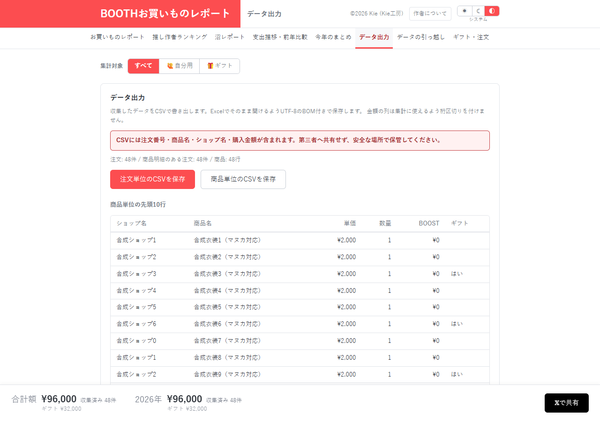

# データ出力：CSVの名称を表計算アプリでどう扱うか確認する

[資料一覧へ](../README.md)。注文単位・商品単位のCSVを保存する画面です。

| 指摘 | 利用者への影響 |
| --- | --- |
| [SEC-01 / P3・Low](../02-security.md#sec-01) | 数式開始文字を含む商品名・ショップ名が、名称のままCSVへ出力される |
| [DATA-01〜04](../01-data-integrity.md) | 保存・復元後の不整合は、エクスポートするデータにも影響する |
| [EFF-01 / P2](../05-efficiency.md#eff-01) | この画面を表示中でも、他のレポートやギフト表まで描画する |

C: 合成の算術式がCSVへ到達することを確認しました。U: 現行BOOTHで名称を設定できる条件、Excelでの解釈・再保存後の挙動は未確認です。情報流出やコード実行の成立は確認していません。

文字列列と数値列を区別し、対象の表計算アプリで文字列として扱える対策を選ぶ必要があります。CSVの引用処理だけでは数式解釈を防げません。購入情報を含む旨と第三者へ共有しない案内は、既に画面にあります。

