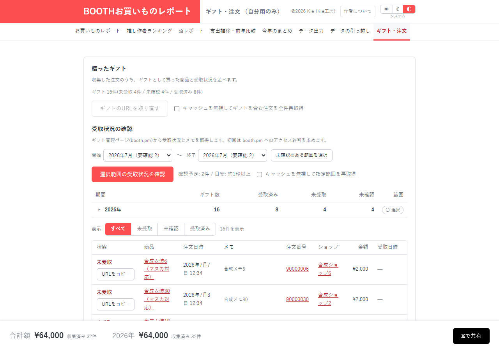
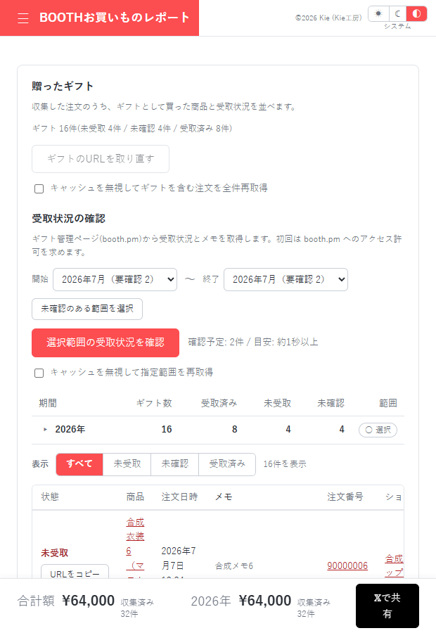

# ギフト・注文：見出しと表の集計対象を一致させる

[資料一覧へ](../README.md)。贈ったギフトの受取状況・メモと、注文ごとの内訳を確認する画面です。

| 指摘 | 利用者・保守担当者への影響 |
| --- | --- |
| [UX-01 / P2](../03-ux.md#ux-01) | 「自分用のみ」という見出しと自分用のフッターに、全ギフトの表が並ぶ |
| [COM-01 / P3](../04-comments.md#com-01) | 「受取済みは二度と取得しない」というコメントが強制再取得の動作と違う |
| [DATA-05 / P2](../01-data-integrity.md#data-05) | 不正なgiftIdを含む復元データでギフト行の組み立てが失敗する |
| [UX-03・04 / P3](../03-ux.md) | メモの移行・削除で、含まれない情報と残る情報が分かりにくい |

全ギフトを表示する仕様に見出しとフッターの説明を合わせます。通常確認とキャッシュ無視の再取得を、コメントでも区別します。

自分用64,000円の条件で、全ギフト16件が並ぶ状態を再現しました。幅620pxでは表の内側で横スクロールし、ページ全体の横はみ出しはありませんでした。受取状況の実取得、権限ダイアログ、URLコピーは未検証です。

