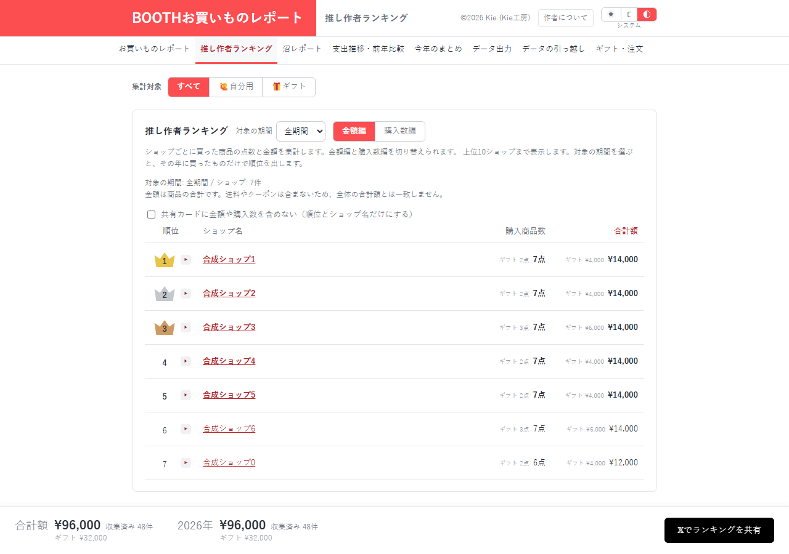

# 推し作者ランキング：保存データの不整合が順位へ波及する

[資料一覧へ](../README.md)。購入した商品をショップごとに集計し、金額または点数で順位を表示する画面です。

| 指摘 | この画面との関係 |
| --- | --- |
| [DATA-01・02 / P1](../01-data-integrity.md) | 再取得失敗や別タブの上書きで失った商品明細が、ショップ集計にも影響する |
| [DATA-03 / P2](../01-data-integrity.md#data-03) | 復元時の重複注文が入力へ残ると、商品も重ねて集計される |
| [EFF-01 / P2](../05-efficiency.md#eff-01) | ランキングを見ていないときにも表を組み立てる |

この画面専用の新たな計算不具合は確認していません。共通の保存・復元処理を直し、各画面へ同じ重複防止処理を追加しない方針が適切です。

送料・クーポンを含まない商品合計であること、全体の合計額とは一致しないことは画面に明記されています。この差自体は不具合に数えていません。共有カードの画像保存や投稿先の実操作は未検証です。

