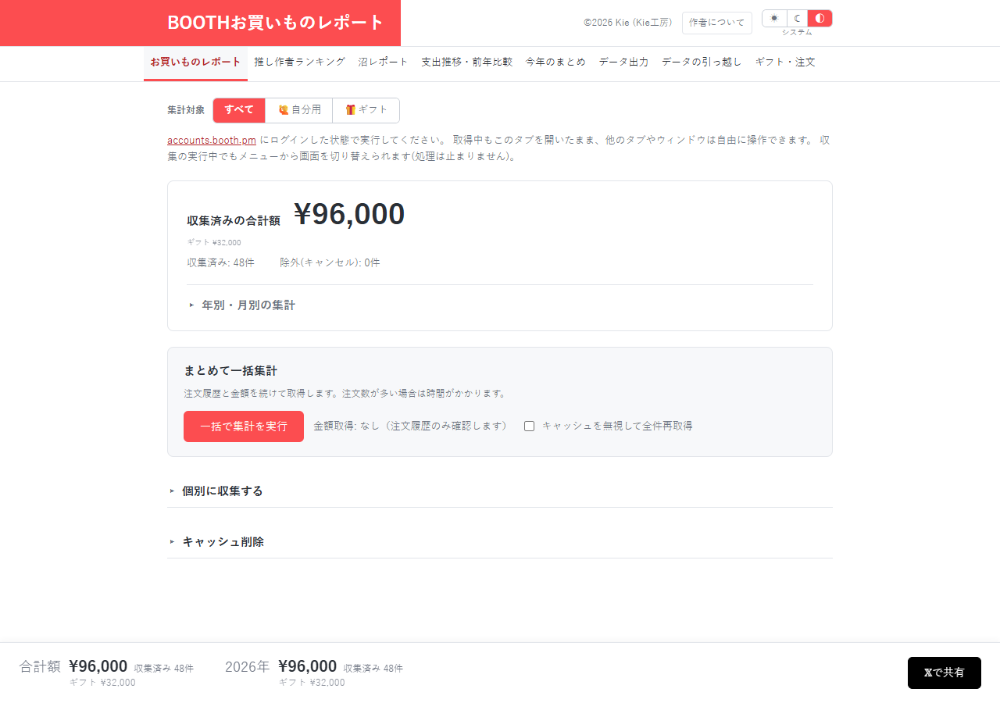

# お買いものレポート：正常な収集結果を失う経路を先に直す

[資料一覧へ](../README.md)。注文履歴・金額を収集し、合計と月別の集計を確認する画面です。

| 指摘 | 利用者への影響 |
| --- | --- |
| [DATA-01 / P1](../01-data-integrity.md#data-01) | 再取得で金額を読み取れないと、保存していた正常な金額まで失う |
| [DATA-02 / P1](../01-data-integrity.md#data-02) | 開いたままの別タブで後から操作すると、新しい保存結果を古い状態で上書きする |
| [DATA-04 / P2](../01-data-integrity.md#data-04) | 注文履歴だけを削除すると、除外済みのキャンセル注文が合計へ戻る |
| [UX-02 / P2](../03-ux.md#ux-02) | 「一括で集計を実行」の文字コントラストが3.3246:1で不足する |
| [UX-04 / P3](../03-ux.md#ux-04) | キャッシュ削除後もメモ等が残り、消去範囲の説明が足りない |
| [EFF-01 / P2](../05-efficiency.md#eff-01) | 収集終了や集計対象の変更で、非表示ページも全件描画する |

まず、読み取り成功まで保存済みデータを保持し、タブ間で最新状態を取り込むようにします。キャンセル除外は注文履歴の有無にかかわらず維持する必要があります。

合成48注文の合計は96,000円でした。正常ケースの表示確認であり、実BOOTHの収集・権限操作は未検証です。

