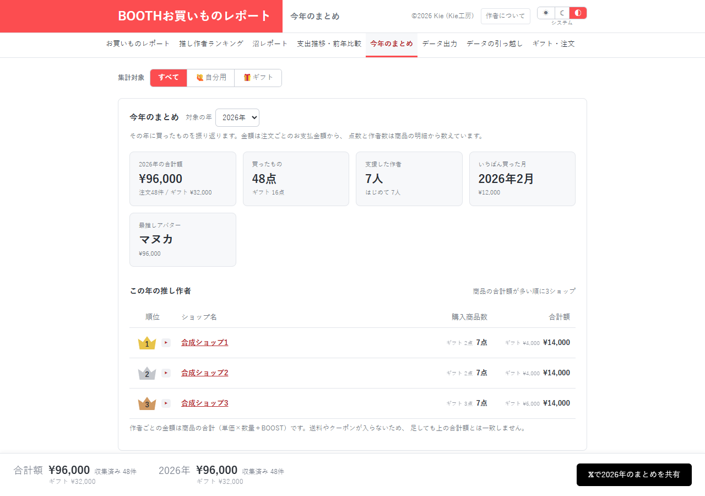

# 今年のまとめ：表示しない年間BOOST集計を削除候補にする

[資料一覧へ](../README.md)。年ごとの金額・購入点数・作者数・購入が多い月などを振り返る画面です。

| 指摘 | この画面との関係 |
| --- | --- |
| [EFF-01 / P2](../05-efficiency.md#eff-01) | 表示していないときにも年間集計やアバター分類を実行する |
| [EFF-02 / P3](../05-efficiency.md#eff-02) | 年間集計のboostとboostItemCountを計算して返すが、製品側で使用していない |
| [DATA-01〜04](../01-data-integrity.md) | 共通データの不整合が年の合計や点数へ波及する |

削除候補は、年間集計が返す未使用フィールドと専用テストです。商品単位のBOOST、購入金額への加算、保存形式、CSV列は利用されているため保持します。

合成48注文・7ショップ・1アバターで表示を確認しました。年間BOOST集計の削除による速度差は未測定です。

