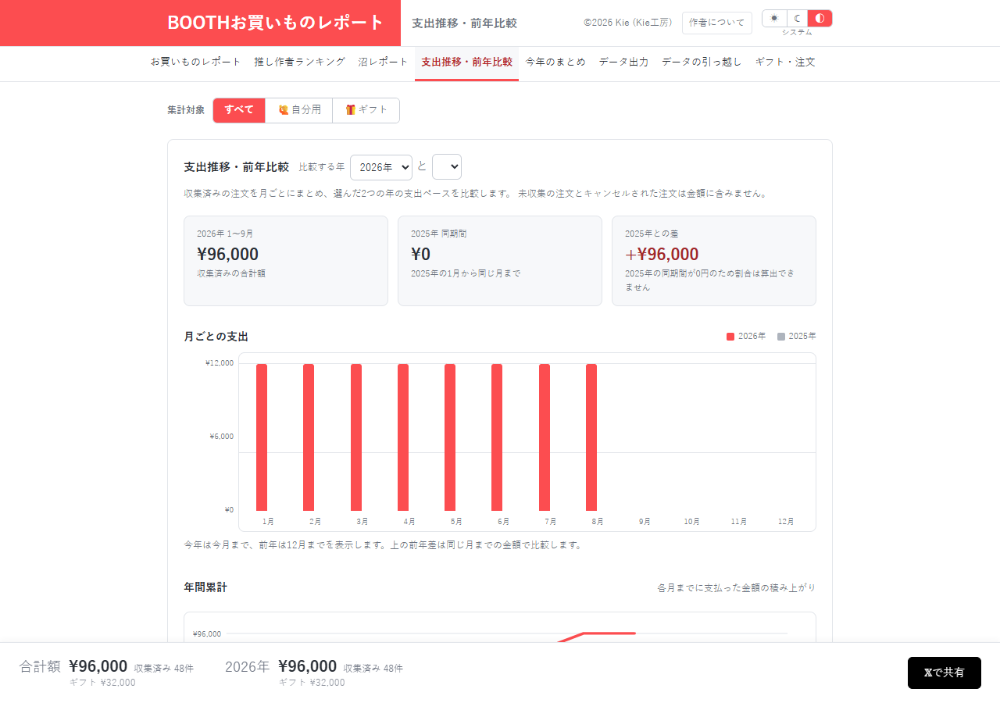

# 支出推移・前年比較：比較年の空欄を解消する

[資料一覧へ](../README.md)。月別支出・年間累計・購入した曜日と時間帯を確認する画面です。

| 指摘 | 利用者への影響 |
| --- | --- |
| [UX-05 / P3](../03-ux.md#ux-05) | 2026年分だけのデータで比較年の選択欄が空になり、カードとグラフには2025年が出る |
| [DATA-01〜04](../01-data-integrity.md) | 保存値の消失・重複・キャンセル復活が支出推移へ波及する |
| [EFF-01 / P2](../05-efficiency.md#eff-01) | 他画面の更新時にもグラフ等を作り直す |

「前年（購入記録なし）」を選択欄へ出すか、比較対象がないことを明示して選択を無効にする案です。未収集の可能性がある範囲では、「記録がない」と「支出0円が確定」を区別する必要があります。

空欄は2026年の合成48注文で再現しました。実際の複数年履歴を使った比較や全期間の操作網羅は未実施です。

